# 🛠️ สรุประบบการสร้าง Action (Action Generation System) อย่างละเอียด

ระบบการสร้าง **Action (Visual Artifacts)** ของโปรเจกต์นี้ เป็นระบบ RAG (Retrieval-Augmented Generation) ขั้นสูงที่ไม่ได้เพียงแค่ตอบคำถามเป็นข้อความทั่วไป แต่สามารถแปลงเอกสารนำเข้า (PDF หรือ Web sources) ให้กลายเป็นสื่อการเรียนรู้เชิงทัศนศิลป์คุณภาพสูง (Premium Visual Artifacts) จำนวน 4 รูปแบบหลัก ได้แก่:

1. **Mindmap (แผนผังความคิด)**: โครงสร้างลำดับความคิดที่คลิกยุบ-ขยายบอร์ด และจัดการแบบสองทิศทางได้บนหน้าเว็บ
2. **Chart (กราฟและแผนภูมิ)**: การวิเคราะห์สถิติตัวเลขในเอกสารและเปลี่ยนให้เป็นชุดข้อมูลเชิงปริมาณและคุณภาพ
3. **Slides (สไลด์นำเสนอ)**: สไลด์ข้อมูลเทคนิคเชิงลึกระดับ HD (16:9) ที่แบ่งย่อยเป็นหน้าๆ พร้อมไอคอนสวยงาม
4. **Infographic (อินโฟกราฟิก)**: แผ่นสรุปสาระสำคัญประกอบด้วยหัวข้อเด่น, ตัวเลขสถิติหลัก (Key Stats) และบทสรุป

---

## 🏗️ 1. สถาปัตยกรรมระบบและเทคโนโลยีที่ใช้ (Tech Stack & Libraries)

การทำงานของระบบแบ่งออกเป็น 2 ฝั่งหลัก คือ **Backend** สำหรับดึงเนื้อหา จัดโครงสร้างข้อมูล และเรนเดอร์ภาพผ่าน Headless Browser และ **Frontend** สำหรับแสดงผลแบบตอบสนองสูง (Interactive UI)

### 🔹 Backend (Python & FastAPI)
*   **FastAPI**: ให้บริการ API Endpoints หลัก:
    *   `POST /actions/generate` : ทริกเกอร์ระบบ 2-Step Pipeline เพื่อประมวลผลข้อมูล RAG
    *   `GET /actions/session/{session_id}` : ดึงข้อมูลการสร้าง Action ทั้งหมดที่บันทึกไว้ใน session นั้นๆ คืนมา
*   **LlamaIndex & BM25**: 
    *   สกัดข้อความจากเอกสารด้วย `extract_text_by_page` (แยกตามหน้าเพื่อทำ Citation)
    *   ใช้ `SentenceSplitter` ควบคู่กับตัวแบ่งคำภาษาไทย `thai_tokenizer` เพื่อทำ chunking
    *   จัดเก็บ Vector Chunks บน **ChromaDB** และค้นหาผ่านคีย์เวิร์ดร่วมกับ **BM25 Retriever**
*   **Generative AI Models (2-Step Pipeline)**:
    *   **Step 1 Model (Chinda - `settings.DEFAULT_LLM_MODEL`)**: ใช้สกัดและสรุปเนื้อหาทางเทคนิคจากคลังข้อความอย่างครอบคลุม ลึกซึ้ง และไม่ให้ข้อมูลตกหล่นหรือมโน (No Hallucination)
    *   **Step 2 Model (Coder - `settings.ACTION_LLM_MODEL`)**: ทำหน้าที่เป็น JSON Formatter นำเนื้อหาดิบมาเรียบเรียงให้อยู่ในโครงสร้าง Schema บังคับอย่างเข้มงวด
*   **Jinja2 & Playwright (`playwright`)**:
    *   **Jinja2**: เป็น Templating Engine นำข้อมูลดิบจาก JSON มาประกอบเข้ากับหน้าเว็บ HTML5 ที่ติดตั้ง CSS/Icons เรียบร้อยแล้ว
    *   **Playwright (Headless Chromium)**: เปิดเบราว์เซอร์ล่องหน โหลดหน้า HTML และตั้งค่า Resolution สัดส่วนคมชัดระดับ HD พร้อมรอสคริปต์ไอคอน `Lucide` วาดรูปเสร็จสิ้นภายใน 300ms จากนั้นบันทึกหน้าจอเป็นภาพ Base64 คืนกลับมา
    *   **ThreadPoolExecutor**: ใช้สำหรับหลีกเลี่ยงข้อผิดพลาด `NotImplementedError` บนระบบปฏิบัติการ Windows โดยรันงาน Playwright บน Thread แยกและตั้งค่า Loop Policy ให้รองรับ Subprocesses อย่างสมบูรณ์ (`WindowsProactorEventLoopPolicy`)

### 🔹 Frontend (React, Vite & xyflow)
*   **@xyflow/react (React Flow)**: ใช้เรนเดอร์บอร์ด Mindmap แบบโต้ตอบได้ (Interactive) รองรับการซูม (Zoom), ลากแพน (Pan), คลิกเพื่อย่อ/ขยายกิ่ง (Collapse/Expand) และคำนวณตำแหน่งแบบกระจายสองทิศทาง (Radial Positions) เพื่อป้องการกิ่งทับซ้อนกันโดยอัตโนมัติ
*   **Tailwind CSS (CSS CDN)**: จัดการสไตล์ดีไซน์สไลด์และอินโฟกราฟิกฝั่ง Backend และสไตล์บอร์ดหลักฝั่ง Frontend ให้เรียบหรู คมชัด สวยงามระดับพรีเมียม (Curated harmonious color palettes)
*   **Zustand (State Store)**: จัดการสถานะและจัดทำ Hydrate ข้อมูล Action ที่บันทึกไว้บน Disk ฝั่ง Backend เพื่อให้เมื่อโหลดหน้าเว็บใหม่ (Refresh) ข้อมูลสไลด์, อินโฟกราฟิก และไมน์แมปจะไม่สูญหายไป

---

## 🔄 2. ขั้นตอนการทำงานและลำดับกระบวนการ (Work Flow)

ระบบนี้ใช้หลักการ **2-Step Generation Pipeline** ร่วมกับการเรนเดอร์ภาพจากหลังบ้านเพื่อแก้ปัญหาโครงสร้างพังและการประมวลผล CSS บนเบราว์เซอร์ของฝั่งผู้ใช้:

```mermaid
sequenceDiagram
    autonumber
    actor User as User (Client)
    participant FE as Frontend (React / React Flow)
    participant BE as Backend (FastAPI Router)
    participant Chroma as ChromaDB / BM25
    participant LLM1 as Main LLM (Chinda)
    participant LLM2 as Coder LLM
    participant Playwright as Playwright Renderer (Jinja2)
    participant Storage as Backend Disk (Storage)

    User->>FE: คลิกเลือกประเภท Action (Mindmap / Slide / Chart / Infographic)
    FE->>BE: POST /actions/generate (session_id, action_type, user_goal)
    
    rect rgb(20, 30, 50)
        Note over BE, Chroma: Step 1: Content Retrieval & Extraction
        BE->>Chroma: ค้นหา Context จากเอกสารและเว็บ (top_k=20)
        Chroma-->>BE: ส่งคืน Chunks และ Metadata
        BE->>LLM1: สรุปและสกัดข้อมูลเชิงลึก (Query + Contexts)
        LLM1-->>BE: ส่งคืน เนื้อหาดิบที่เจาะลึกแบบสมบูรณ์
    end

    rect rgb(30, 20, 50)
        Note over BE, LLM2: Step 2: Format Structuring
        BE->>LLM2: ส่งเนื้อหาดิบ + System Prompt (บังคับ JSON Schema / Markdown)
        LLM2-->>BE: ส่งคืน Raw JSON / Markdown
    end

    alt Action คือ Mindmap
        BE->>BE: parse_mindmap_markdown() (แปลง # เป็น Nodes & Edges Hierarchy)
    else Action คือ Slide หรือ Infographic (และมี Playwright)
        rect rgb(20, 50, 30)
            Note over BE, Playwright: Step 3: Backend Visual Rendering
            BE->>Playwright: Jinja2 Compile (JSON + Tailwind HTML Template)
            Playwright->>Playwright: รัน Headless Chromium และเปิดหน้าเว็บ
            Playwright->>Playwright: รอ Lucide Icons โหลด (300ms) แล้วแคปเจอร์ PNG
            Playwright-->>BE: ส่งคืน Base64 Image String
        end
    end

    BE->>Storage: บันทึกไฟล์ JSON ในโฟลเดอร์ actions/ (เพื่อรองรับการ Refresh)
    BE-->>FE: ส่งคืน ActionGenerateResponse (Base64 / JSON Nodes / Citations)
    
    alt Render ใน Frontend
        FE->>FE: แสดงผลลัพธ์ Action ที่ตอบกลับ
        Note over FE: - Mindmap: วาดกราฟด้วย React Flow (ซูม/ย่อ/ขยายบอร์ด)<br/>- Slide/Infographic: แสดงภาพเรนเดอร์คุณภาพสูงและปุ่มดาวน์โหลด
    end
```



---

## 🔎 3. รายละเอียดเชิงลึกรายโมดูลหลัก (Deep Dive Code & Templates)

### 📂 3.1 การสกัดและแปลงโครงสร้างข้อมูล Action (ใน [actions.py](file:///c:/Work/rag-llm/backend/app/api/routes/actions.py))
เมื่อผู้ใช้ร้องขอการสร้าง Action ตัว API จะแบ่งขั้นตอนเป็นสองส่วนตามรูป:
*   **สกัดข้อมูลดิบ**: ดึง `top_k=20` จากฐานข้อมูล และรันด้วยคำสั่งสกัดรายละเอียดทางเทคนิคเจาะลึกพิเศษ ป้องกันการรวบยอดหรือสรุปแบบหยาบๆ
*   **จัดฟอร์แมต JSON**: ส่งชุดข้อมูลเข้าไปหา Coder LLM โดยมีตัวอย่างโครงสร้าง JSON (JSON Schema Prompt) ที่ระบุหมวดหมู่ ไอคอนที่กำหนด สถิติตัวเลขเด่น และคำอธิบายความยาวเฉพาะ (เช่น สไลด์แต่ละแผ่นต้องมี key_points 3-4 ข้อ ยาว 35-55 คำต่อข้อ)

### 🎨 3.2 ระบบเรนเดอร์ภาพจากเบื้องหลัง (ใน [renderer.py](file:///c:/Work/rag-llm/backend/app/services/renderer.py))
สำหรับ **Slides** และ **Infographic** ระบบจะแปลงข้อมูลโครงสร้าง JSON เป็นหน้าเพจความละเอียดสูง (1200x675 px สำหรับสไลด์หน้าเดี่ยว และ 900x800 px เป็นขนาดตั้งต้นสำหรับอินโฟกราฟิก)
```python
# ตัวอย่างหน้า HTML สไลด์เดี่ยว (SINGLE_SLIDE_HTML_TEMPLATE)
# 1. โหลดไลบรารีสไตล์ภายนอกและฟอนต์ Sarabun / Inter
# 2. ใช้ Jinja2 ในการลูปคีย์พอยต์และไอคอน
# 3. ให้ Playwright แคปเจอร์ PNG ความละเอียดสูงผ่าน device_scale_factor=2
context = await browser.new_context(
    viewport={"width": width, "height": height},
    device_scale_factor=2 # คมชัดระดับ Retina HD
)
```
หากเป็นสไลด์ที่มีหลายหน้า (`slides`) ระบบจะทำการ **Render ทีละหน้าสไลด์วนลูป** แล้วนำภาพ Base64 บันทึกกลับลงไปในคีย์ `image` ของสไลด์แต่ละตัว ทำให้ฝั่งหน้าจอ React สามารถลื่นไหลกับการเลื่อนพรีวิวทีละสไลด์เดี่ยวได้ทันที

### 🌲 3.3 ระบบจัดเรียง Mindmap เชิงลึก (ใน [document_processor.py](file:///c:/Work/rag-llm/backend/app/services/document_processor.py#L215-L295))
สำหรับ **Mindmap** โมเดลจะส่งเนื้อหากลับมาเป็นโครงสร้าง Markdown ลำดับชั้นแบบดิบ:
```markdown
# ระบบจัดการร้านอาหาร
## การสั่งอาหาร
### รับออเดอร์หน้าร้าน
### รับออเดอร์ออนไลน์
```
ฟังก์ชัน `_parse_markdown_hierarchy` จะอ่านทีละบรรทัด นับจำนวนเครื่องหมาย `#` เพื่อแบ่งระดับความลึก (`level`) แล้วสแกนเก็บ `node_id` และสร้างความสัมพันธ์ลูก-แม่กับ `parentId` รวมถึงโยงเส้นเชื่อมต่อ `smoothstep` (Edges) ที่เคลื่อนไหวได้แบบอัตโนมัติ ส่งให้ React Flow หน้าบ้านทำงานอย่างแม่นยำ

---

## 💾 4. ระบบบันทึกข้อมูลถาวร (Actions Persistence)

ระบบบันทึกผลลัพธ์ Action ลงใน Directory `actions/` ฝั่ง Backend เพื่อช่วยให้เวลาผู้ใช้โหลดหน้าใหม่ข้อมูลก็ยังถูกนำมาแสดงเช่นเดิม:
*   **การจัดเก็บ**: เมื่อประมวลผลเสร็จสิ้น ข้อมูลจะถูกดัมพ์เป็น JSON ลงในไฟล์ `action_{session_id}_{action_type}.json`
*   **การดึงข้อมูล**: เมื่อผู้ใช้เปิดหน้าแชท หน้าบ้านจะส่งคำขอ `GET /actions/session/{session_id}` ตัวบริการจะค้นหาไฟล์ทั้งหมดในระบบที่ขึ้นต้นด้วยรหัส Session ดังกล่าว และส่งโครงสร้างทั้งหมดกลับไปให้หน้าร้านแสดงผลแบบ Hydration ทันที

---

> [!TIP]
> **สรุปจุดเด่นของระบบ Action ในโปรเจกต์นี้**:
> 1. **ความคมชัดสูงพิเศษ**: การใช้ Playwright + `device_scale_factor=2` บนหลังบ้าน ทำให้มั่นใจได้ว่าตัวหนังสือภาษาไทยและไอคอนจะมีความสมบูรณ์คมชัดสูงมาก ไม่ต้องกังวลเรื่องปัญหาฟอนต์พังบนอุปกรณ์พกพาของฝั่งผู้ใช้
> 2. **มี RAG ร่วมดึงข้อมูลคุณภาพสูง**: การทำความเข้าใจและสกัดเนื้อหาด้วย `top_k=20` ควบคู่กันทั้ง Vector และ BM25 ทำให้เนื้อหาบน Artifacts สมบูรณ์และถูกต้องตามเนื้อหาจริงจากเอกสาร
> 3. **ตอบสนองสมจริง**: Mindmap ขับเคลื่อนด้วย React Flow ทำให้คลิกขยับซูมหรือยุบหัวข้อหลักเพื่อเน้นประเด็นย่อยในที่ประชุมได้อย่างลื่นไหล
